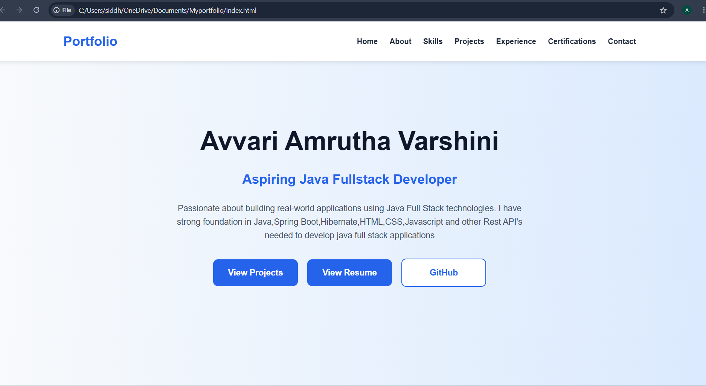
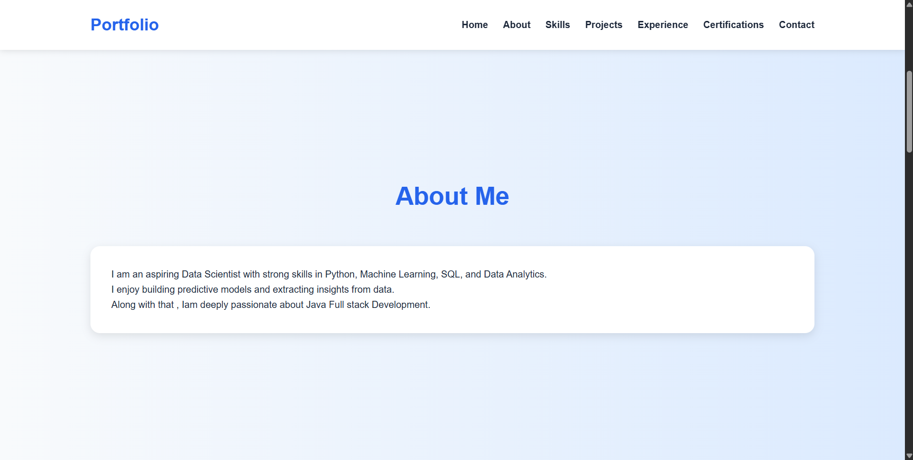
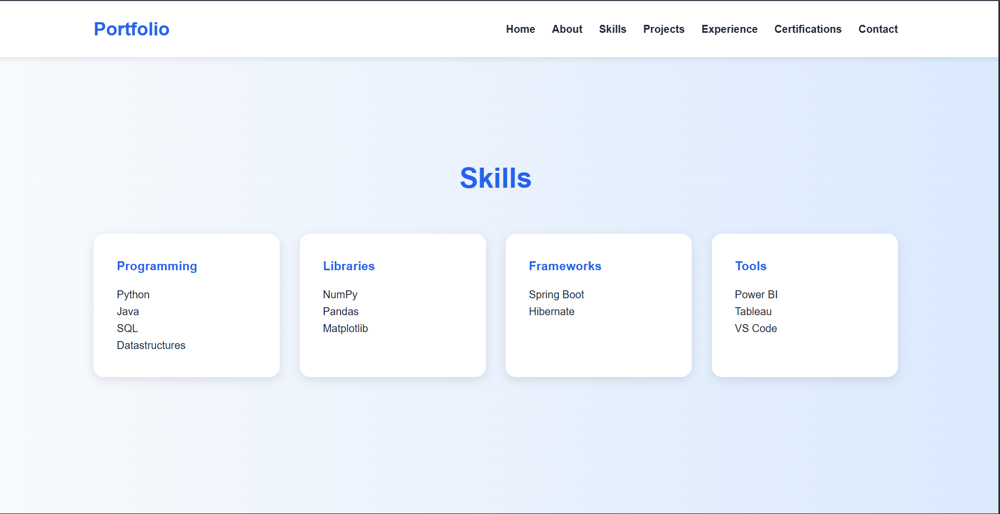
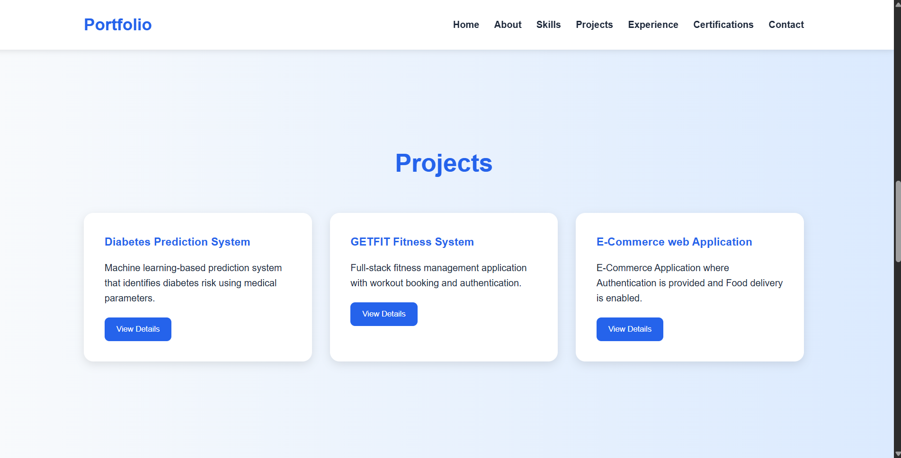
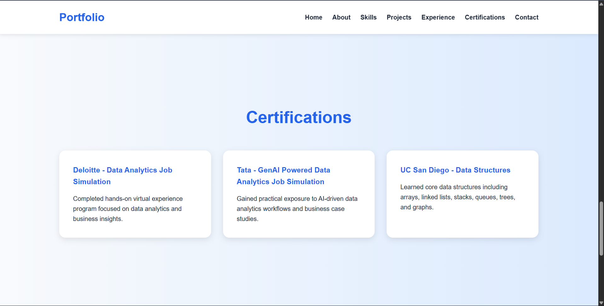
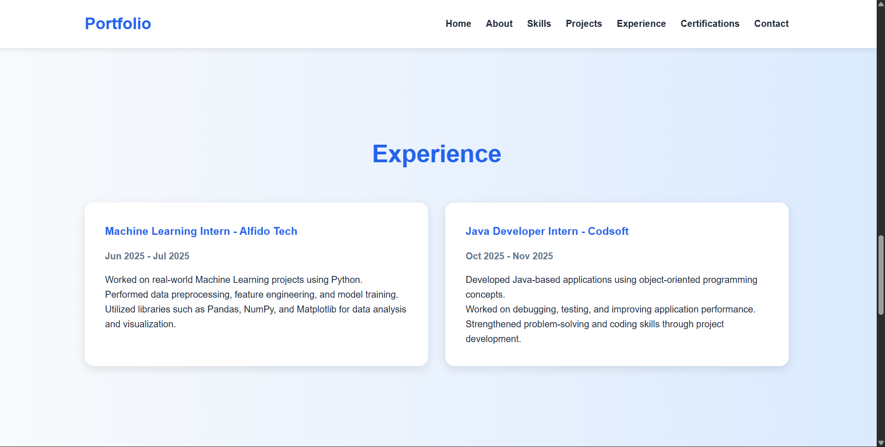
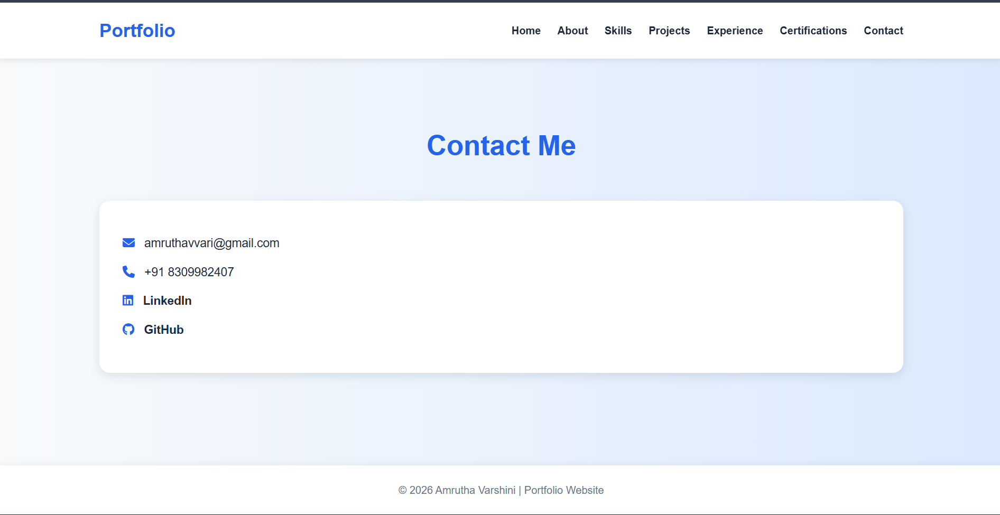

# Personal Portfolio Website 🌐

A modern and responsive personal portfolio website built to showcase my skills, projects, certifications, experience, and contact information.

🔗 Live Demo: https://amruthavarshiniavvari.github.io/My-Portfolio/

---

## 🚀 Features

- Responsive portfolio website
- About Me section
- Skills showcase
- Projects section
- Certifications section
- Experience section
- Contact section
- Clean and modern UI
- Smooth navigation

---

## 🛠️ Tech Stack

- HTML
- CSS
- JavaScript

---

## 📂 Project Structure

```text
My-Portfolio/
│__ DataSientist.pdf
├── index.html
├── style.css
├── script.js
├── screenshots/
└── README.md
```

---

## 📸 Screenshots

### Home Page



---

### About Section



---

### Skills Section



---

### Projects Section



---

### Certifications Section



---

### Experience Section



---

### Contact Section



---

## 🎯 Purpose of the Project

This portfolio website was created to:

- Showcase my projects and achievements
- Highlight my technical skills
- Build a professional online presence
- Practice frontend development concepts

---

## 👩‍💻 Author

Amrutha varshini Avvari

GitHub: https://github.com/AmruthavarshiniAvvari

Portfolio: https://amruthavarshiniavvari.github.io/My-Portfolio/

---

