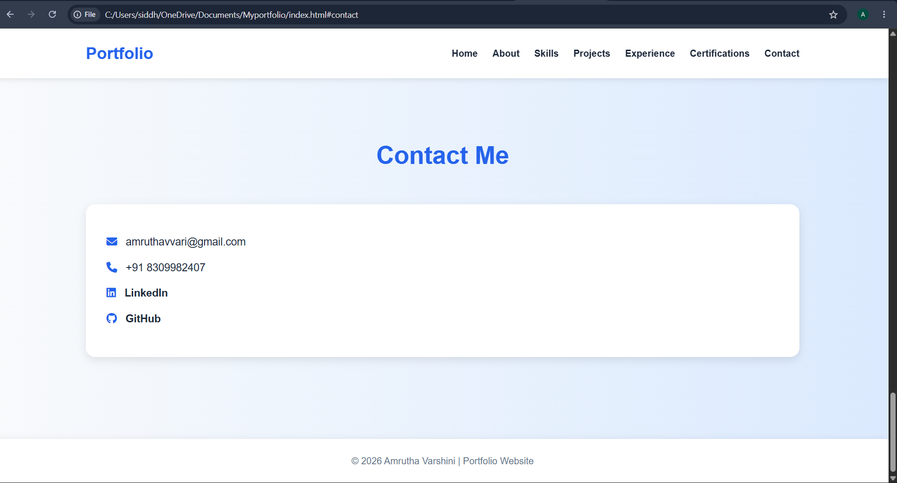

# Personal Portfolio Website

Welcome to my personal portfolio website repository.  
This project showcases my skills, projects, resume, and contact information as a Java Full Stack Developer.

---

## 🚀 Technologies Used

- HTML5
- CSS3
- JavaScript
- PHP
- MySQL

---

## 📌 Features

- Responsive Design
- Modern UI Layout
- About Me Section
- Skills Section
- Projects Showcase
- Contact Form
- Resume Download Option

---

## 📂 Project Structure

```bash
my-portfolio/
│
├── index.html
├── style.css
├── script.js
├── screenshots/
├── JavaFullStackDeveloper.pdf
└── README.md
```

---

## 📸 Screenshots

### 🏠 Home Page


---

### 👩‍💻 About Section


---

### 🛠️ Skills Section


---

### 📂 Projects Section


---

### 📞 Contact Section


---

### 💼 Experience Section


---

### 🏆 Certifications Section


---

## 👩‍💻 Author

Amrutha Varshini Avvari

---

## 📬 Contact

- GitHub: https://github.com/AmruthavarshiniAvvari
